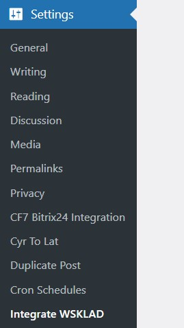
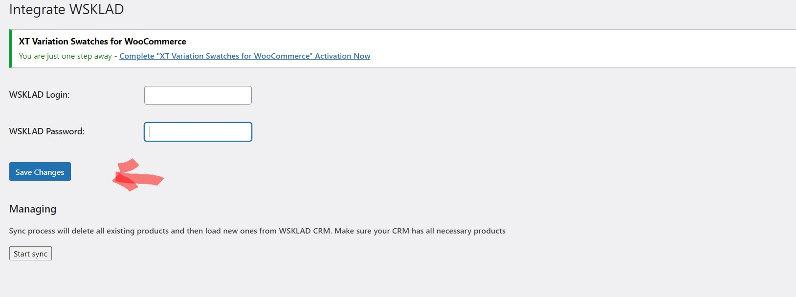
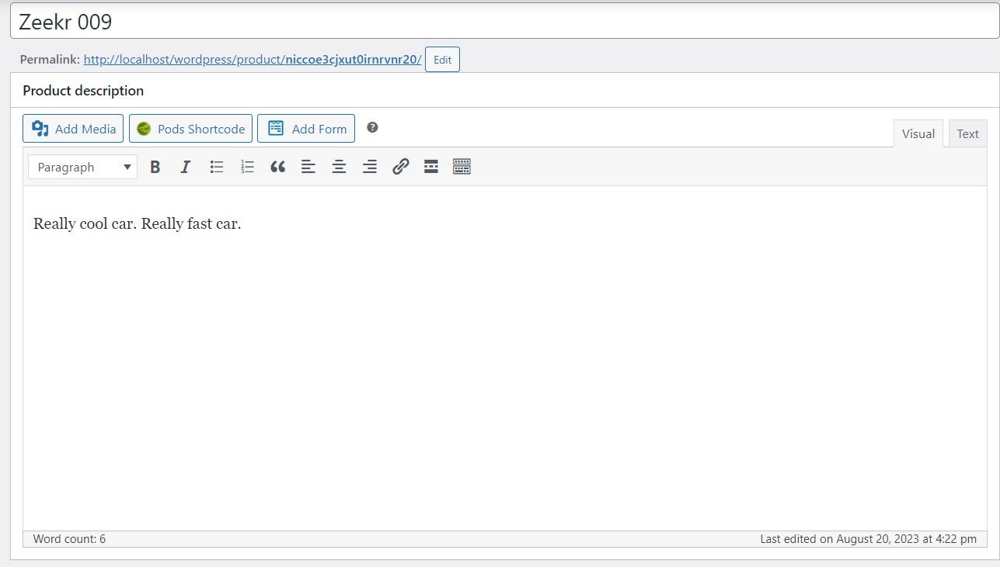
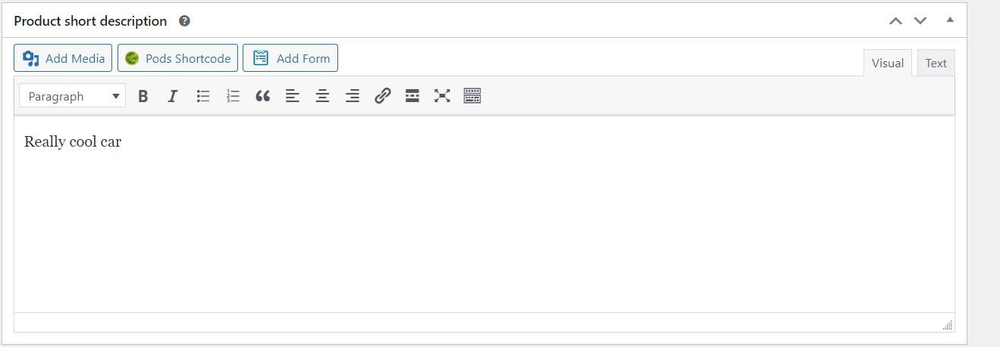
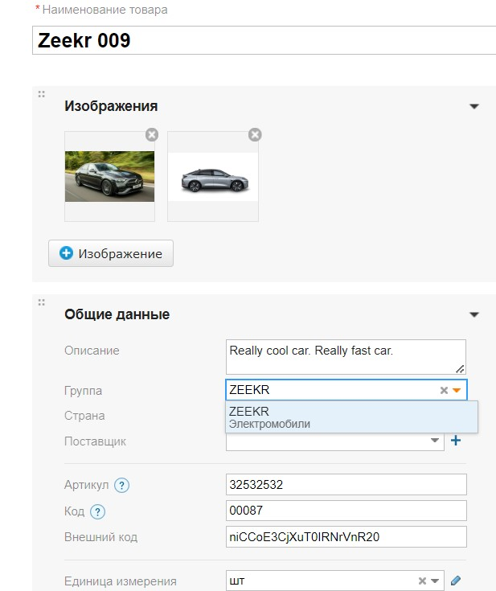
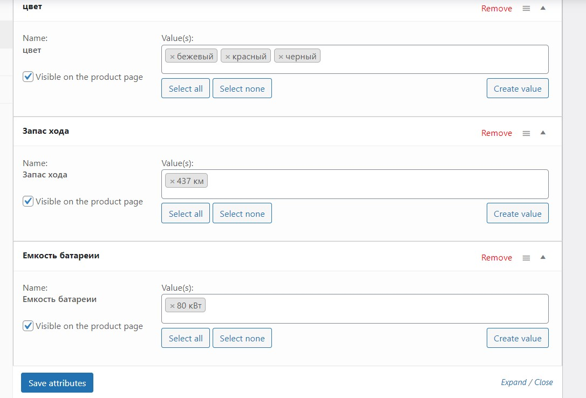
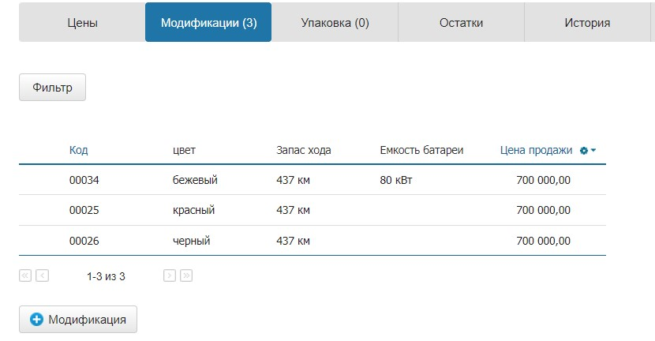
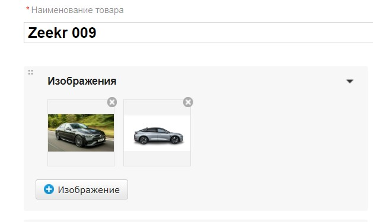
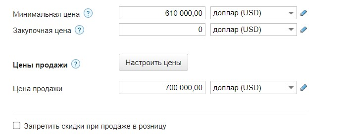
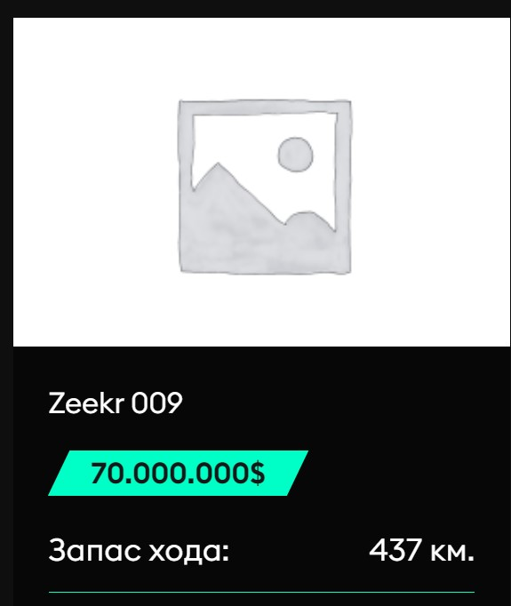

# WSKLAD Integration plugin for WordPress Woocommerce

## Установка

Скопируйте папку "integrate-wsklad" в /wp-content/plugins в WordPress

## Настройка

На странице настроек, введите логин и пароль от МойСклад и нажмите сохранить.

## Синхронизация

Для того чтобы запустить синхронизацию нажмите Start sync, после чего плагин начнет процесс удаления товаров, затем начнется процесс создания товаров полученных из МойСклад. После создания товаров, плагин начнет загрузку картинок для каждого товара. Синхронизация работает на отсроченных хуках, то есть действия происходят последовательно по расписанию в виде рекурсии. Товары удалаются/создаются пачками, например первый хук загрузил и начал создавать 20 товаров, после этого он поставил в очередь следующие 20 товаров и тд. Синхронизацию можно отменить однако, если хук уже начал исполнение, синхронизация прекратится только со следующим хуком.

Процесс занимает довольно длительное время, так что не спешите отменять синк, если вам кажется что ничего не происходит. Если же все таки синк застрял, можно открыть логи или перезапустить синк. Логи находятся в wp-content/plugins/integrate-wsklad/debug.log.

## Отображение товаров

Название товара будет такое же как в МойСклад. Описание товара будет также синхронизированно с МойСклад. Первое предложение в описании (до точки) пойдет в краткое описание товара. Категории будут браться из группы товаров (Электромобили/ZEEKR = Электромобили, ZEEKR).

Модификации синхронизируются с уже имеющимися на сайте аттрибутами по названию, если вы хотите добавить дополнительно значение аттрибута (например бежевый цвет), вы можете просто указать его в МойСклад, плагин сам обновит аттрибут на WordPress. Также, необязательно создавать новый глобальный аттрибут на сайте, если вы хотите добавить новый тип характеристик, плагин сделает это за вас.

Картинки товара подтягиваются следующим образом. Первая картика пойдет в thumbnail все остальные в галерею товара.

Минимальная цена товара пойдет в поле price, первая цена продажи пойдет в regular price (то что отобразится на сайте), если есть вторая цена продажи она пойдет в скидку.

