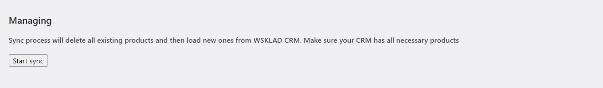

# WSKLAD Integration plugin for WordPress Woocommerce

## Установка

Скопируйте папку "integrate-wsklad" в /wp-content/plugins в WordPress.

## Настройка

На странице настроек, введите логин и пароль от МойСклад и нажмите сохранить.
Ссылка *Pic download reroute server endpoint (optional):* если потеряли: `https://reroute-server.onrender.com/load-wsklad-image`


## Синхронизация

Чтобы картинки загрузились корректно необходимо нажать Wake up server. Это рераут сервер который загружает картинки для товаров, так как кидать запросы на порт 8000 на данном хостинге нельзя, а МойСклад хранит их там. Как только мы разбудили сервер можем начинать синк. Просто не закрывайте отдельную вкладку с сервером пока синк идет. 
Для того чтобы запустить синхронизацию нажмите Start sync, после чего плагин начнет процесс обновления всех товаров, полученных из МойСклад. Иногда может быть так что вы нажали кнопку, но ничего не произошло (просто попробуйте перезапустить админку). Пожалуйста нажимайте кнопку только один раз, в противном случае, если нажмете несколько раз синк может отмениться. После обновления товаров, плагин начнет загрузку картинок для каждого товара. Товары которые не были изначально загружены через этот плагин не удаляются. Синхронизация работает на отсроченных хуках, то есть действия происходят последовательно по расписанию в виде рекурсии. Товары удалаются/создаются пачками, например первый хук загрузил и начал создавать 20 товаров, после этого он поставил в очередь следующие 20 товаров и тд. Синхронизацию можно отменить однако, если хук уже начал исполнение, синхронизация прекратится только со следующим хуком.

Процесс занимает довольно длительное время, так что не спешите отменять синк, если вам кажется что ничего не происходит. Если же все таки синк застрял, можно открыть логи или перезапустить синк. Логи находятся в wp-content/plugins/integrate-wsklad/debug.log.

## Процесс отслеживания синка

Для этого в панеле настроек плагина есть Debug Log, он не обновляется в реальном времени, чтобы увидеть новую информацию необходимо перезагрузить страницу. 
Самое интересное для вас в логах это строчки **Scheduled action: ...** и **Finished successfully**.
Первое показывает на каком этапе сейчас находится синк. Всего их 6:

- 'Unpublish products' - Перевести товары на сайте в статус драфта (берутся только те, которые имеют отношение к МойСклад)
- 'Update products' - Загрузить товары с МойСклад и обновить их на сайте
- 'Update product variations' - Загрузить модификации товаров с МойСклад и обновить вариации на сайте
- 'Load images' - Загрузить картинки для товаров и вариаций
- 'Fill ACF fields for products' - Заполнить Дополнительные поля, которые предоставляет ACF плагин
- 'Delete draft products' - Удалить товары, которых больше нет на МойСклад. Товары, которые изначально не были в МойСклад остаются.

Как было описано ранее, каждый этап работает на отсроченных хуках. Это значит что этапы выполняются поочереди. Иногда хук может висеть в очереди до 10 минут (это зависит от платформы). Сами этапы могут повторяться, так как товары обрабатываются пачками (batch), за это отвечает настройка **Products per hook**. Ee можно не трогать. Оптимально будет значение 50. Если поставить большое значение, хук зависнет - это ограничение платформы.

### Как понять что хук завис

Перезагрузите страницу в админке. Посмотрите сколько прошло с момента последнего сообщения в логах. Иногда хук может ждать своей очереди 20 минут. Но если хук завис на любой другой строчке кроме **Scheduled action: ...**, значит синк завис.




## Отображение товаров

Категории будут браться из группы товаров (Электромобили/ZEEKR = Электромобили, ZEEKR).

Модификации синхронизируются с уже имеющимися на сайте аттрибутами по названию, если вы хотите добавить дополнительно значение аттрибута (например бежевый цвет), вы можете просто указать его в МойСклад, плагин сам обновит аттрибут на WordPress. Также, необязательно создавать новый глобальный аттрибут на сайте, если вы хотите добавить новый тип характеристик, создайте новую модификацию в МойСклад и дайте ей название, плагин создаст аттрибут на сайте за вас.


Картинки товара подтягиваются следующим образом. Первая картика пойдет в thumbnail все остальные в галерею товара.


Минимальная цена товара пойдет в поле price, первая цена продажи пойдет в regular price (то что отобразится на сайте), если есть вторая цена продажи она пойдет в скидку.


## Дополнительные блоки

На сайте используется дополнительный плагин, который позволяет заполнять доп. блоки. Наш плагин тоже заполняет их. Картинки берутся в том порядке, в котором они загружены на МойСклад. 


Блок технологии берется из Описания товара на МойСклад. Чтобы сделать заголовок, оберните текст в h1 тэг, а текст в Р тэг. Пример:
```
<h1>First title </h1>
<p>First block</p>
<p>Second block</p>
<h1>Second title</h1>

```


Классы берутся из Модификаций c характеристикой **version** на МойСклад


Лучший способ посмотреть как что обновляется - это сравнить товар в админке с товаром в МойСклад. Например этот:


